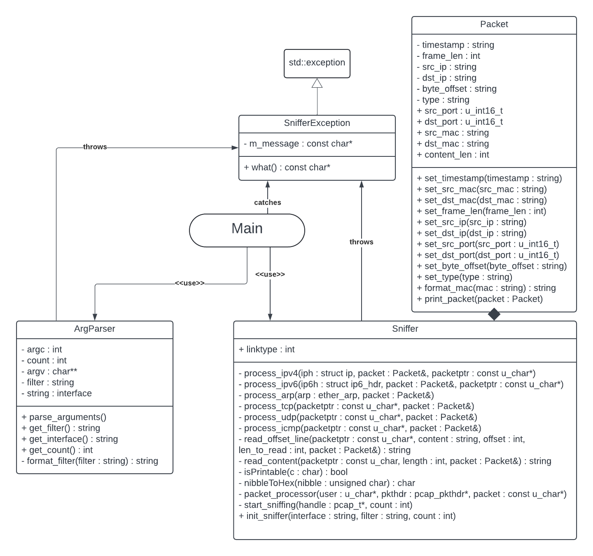
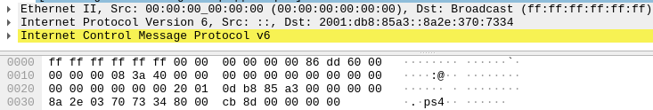

# IPK Project 2 - ZETA: Network sniffer
Author: Dominik Horut (xhorut01) 

## Table of contents
1. [Introduction](#introduction)
2. [Brief theory](#brief-theory)
3. [Usage of sniffer](#usage-of-sniffer)
4. [Processing of the arguments](#processing-of-the-arguments)
5. [Main function](#main-function)
6. [Testing](#testing)
7. [Sniffer](#sniffer)
8. [Packet](#packet)
9. [Error handling](#error-handling)
10. [Whole program structure UML class diagram](#whole-program-structure-uml-class-diagram)
11. [Testing](#testing)
12. [License](#license)
13. [Code documentation](#code-documentation)
14. [Bibliogrphy](#bibliography)

## Introduction
The aim of this project was to create network sniffer able to capture and display different types of packets. The entire project is written in C++ using C++20 standard, witch compilation facilitated by Makefile

## Brief theory<sup>[1]</sup>
Sniffer is capable of capturing different protocol data units.
Therefore, it captures segments (TCP), datagrams (UDP) and packets (ICMP4, ICMP6, IGMP, NDP and MLD) and also frames (ARP).
The difference between each PDU depends on the layer they are in:
* **Segment** is PDU of transport layer and contains source and destination port
* **Datagram** and packets is PDU of network layer and contains source and destination IP addresses
* **Frame** is PDU of data-link layer and contains source and destination MAC addresses


## Usage of sniffer
The project can be compiled by command `make`, which creates executable `ipk-sniffer`. The sniffer itself can be run using the following command:<br>
`./ipk-sniffer [-i interface | --interface interface] {-p|--port-source|--port-destination port [--tcp|-t] [--udp|-u]} [--arp] [--ndp] [--icmp4] [--icmp6] [--igmp] [--mld] {-n num}`

The meaning of each argument is described in the table<sup>[3]</sup> below:<br>
| Argument          | Value | Meaning
|-------------------|---------|-------|
| `-i` or `--interface` | interface or no value | sniff on provided interface (interface given) or list all available interfaces (no value given)|
| `-t` or `--tcp` | - | will display only TCP segments |
| `-u` or `--udp` | - | will display only UDP datagrams |
| `-p` | 0 to 65535 | expands tcp and udp parameters to filter them based on port number |
| `--port-destination` | 0 to 65535 | expands tcp and udp parameters to filter them based on destination port number |
| `--port-source` | 0 to 65535 | expands tcp and udp parameters to filter them based on source port number |
| `--icmp4` | - | will display only ICMPv4 packets |
| `--icmp6` | - | will display only ICMPv6 packets |
| `--arp` | - | will display only ARP frames |
| `--ndp` | - | will display only NDP packets |
| `--igmp` | - | will display only IGMP packets |
| `--mld` | - | will display only MLD packets |
| `-n` | number | specifies the number of packets to display (`-n 1` by default) |

## Processing of the arguments
To process arguments, class `ArgParser` implemented in `tools.cpp` is used. In this class, every argument given from command line is checked and depending on argument, the filter string is filled to be later used by `pcap_compile()` function. In case of invalid argument, exception is thrown.

## Main function
The main function of program first calls `ArgParser` instance to process arguments and depending on result from it, list of available interfaces is printed or if interface is given, the sniffing process starts by calling `Sniffer` instance to start sniffing. 

## Sniffer 
When `Sniffer` is called, it starts with method `sniffer_init()` which prepares all necessary things to actually start sniffing. After everything is set up, `pcap_loop()` is used to capture packets, which are then processed by calling `process_packet()` method. In this method, `Packet` instance is created and according to captured packet, its attributes are set (timestamp, MAC address and frame length). Then, depending on ethernet type, packet is further processed:
* `process_ipv4()` and later `process_tcp()`, `process_udp()` or `process_icmp()` when ethernet type is `ETHERTYPE_IP`.
* `process_ipv6()` when the type is `ETHERTYPE_IPV6`.
* `process_arp()` in case of `ETHERTYPE_ARP`.

In all of these cases, IP addresses and ports (if there are some) are set to attribute of `Packet` instance. After that, payload is read using `read_content()` method and is again saved in `Packet` instance. 

## Packet
Network packet itself is represented by class `Packet`, which has all possible attributes, setters for these attributes and also methods `format_mac()`, which transforms MAC address of packet into required format and method `print_packet()`, which is called after the whole packet is processed to print all information about captured packet in Wireshark-like format. 

## Error handling
For handling errors, exceptions are used. The exception is represented by class `SnifferException`. When `SIGINT` signal occurs, it is handled by `sigint_handler()` method, which frees allocated memory prints the description and cause of an error and exits.

## Whole program structure UML class diagram


## Testing
For testing, student tests<sup>[5]</sup> combined with my own tests were used. My own testing was done by comparing every output from sniffer to Wireshark output, used as reference. Valgrind was also used to ensure correct work with memory. The packets were send with Python script `sender.py` using Scapy library, where each packet type has its own `send()` function 

### Available interfaces test
CLI input:<br>
``` sudo ./ipk-sniffer -i ```<br>
Sniffer output:<br>
```
Available interfaces:
enp1s0f1
wlp2s0
any
lo
bluetooth0
bluetooth-monitor
nflog
nfqueue
dbus-system
dbus-session
```
### Invalid interface test
CLI input:<br>
```sudo ./ipk-sniffer -i ipk```<br>

Sniffer output:<br>
```
Sniffer error: Invalid interface
```
### TCP with specified port test
CLI input:<br>
`sudo ./ipk-sniffer -i wlp2s0 -p 48 --tcp`<br>
Sniffer output:<br>
```
timestamp: 2024-04-19T19:51:44+0000
src MAC: 00:00:00:00:00:00
dst MAC: ff:ff:ff:ff:ff:ff
frame length: 89
src IP: 127.0.0.1
dst IP: 127.0.0.1
src port: 20
dst port: 48

0000: ff ff ff ff ff ff 00 00 00 00 00 00 08 00 45 00  ........ ......E.
0010: 00 4b 00 01 00 00 40 06 7c aa 7f 00 00 01 7f 00  .K....@. |.......
0020: 00 01 00 14 00 30 00 00 00 00 00 00 00 00 50 02  .....0.. ......P.
0030: 20 00 96 17 00 00 47 45 54 20 2f 20 48 54 54 50   .....GE T / HTTP
0040: 2f 31 2e 31 0d 0a 48 6f 73 74 3a 20 6c 6f 63 61  /1.1..Ho st: loca
0050: 6c 68 6f 73 74 0d 0a 0d 0a                       lhost... .
```
Wireshark output:<br>


### UDP with specified destination port test
CLI input:<br>
`sudo ./ipk-sniffer -i lo --port-destination 84`<br>
Sniffer output:<br>
```
timestamp: 2024-04-19T19:58:51+0000
src MAC: 00:00:00:00:00:00
dst MAC: ff:ff:ff:ff:ff:ff
frame length: 42
src IP: 127.0.0.1
dst IP: 127.0.0.1
src port: 54321
dst port: 84

0000: ff ff ff ff ff ff 00 00 00 00 00 00 08 00 45 00  ........ ......E.
0010: 00 1c 00 01 00 00 40 11 7c ce 7f 00 00 01 7f 00  ......@. |.......
0020: 00 01 d4 31 00 54 00 08 2d 56                    ...1.T.. -V
```
Wireshark output:<br>


### UDP with specified source port test
CLI input:<br>
`sudo ./ipk-sniffer -i lo --port-source 420`<br>
Sniffer output:<br>
```
timestamp: 2024-04-19T20:04:59+0000
src MAC: 00:00:00:00:00:00
dst MAC: ff:ff:ff:ff:ff:ff
frame length: 42
src IP: 127.0.0.1
dst IP: 127.0.0.1
src port: 420
dst port: 25

0000: ff ff ff ff ff ff 00 00 00 00 00 00 08 00 45 00  ........ ......E.
0010: 00 1c 00 01 00 00 40 11 7c ce 7f 00 00 01 7f 00  ......@. |.......
0020: 00 01 01 a4 00 19 00 08 00 1f                    ........ ..
```
Wireshark output:<br>


### ICMP4 test
CLI input:<br>
`sudo ./ipk-sniffer -i lo --icmp4`<br>
Sniffer output:<br>
```
timestamp: 2024-04-19T20:08:35+0000
src MAC: 00:00:00:00:00:00
dst MAC: ff:ff:ff:ff:ff:ff
frame length: 42
src IP: 127.0.0.1
dst IP: 127.0.0.1
src port: -
dst port: -

0000: ff ff ff ff ff ff 00 00 00 00 00 00 08 00 45 00  ........ ......E.
0010: 00 1c 00 01 00 00 40 01 7c de 7f 00 00 01 7f 00  ......@. |.......
0020: 00 01 08 00 f7 ff 00 00 00 00                    ........ ..
```

Wireshark output:<br>


### ICMP6 test
CLI input:<br>
`sudo ./ipk-sniffer -i lo --icmp6`<br>
Sniffer output:<br>
```
timestamp: 2024-04-19T20:14:15+0000
src MAC: 00:00:00:00:00:00
dst MAC: ff:ff:ff:ff:ff:ff
frame length: 62
src IP: ::
dst IP: 2001:db8:85a3::8a2e:370:7334
src port: -
dst port: -

0000: ff ff ff ff ff ff 00 00 00 00 00 00 86 dd 60 00  ........ ......`.
0010: 00 00 00 08 3a 40 00 00 00 00 00 00 00 00 00 00  ....:@.. ........
0020: 00 00 00 00 00 00 20 01 0d b8 85 a3 00 00 00 00  ...... . ........
0030: 8a 2e 03 70 73 34 80 00 cb 8d 00 00 00 00        ...ps4.. ......
```
Wireshark output:<br>


### ARP test
CLI input:<br>
`sudo ./ipk-sniffer -i wlp2s0 --arp`<br>
Sniffer output:<br>
```
timestamp: 2024-04-19T20:18:11+0000
src MAC: a8:1e:84:81:5a:77
dst MAC: ff:ff:ff:ff:ff:ff
frame length: 42
src IP: 10.10.70.106
dst IP: 192.168.1.1
src port: -
dst port: -

0000: ff ff ff ff ff ff a8 1e 84 81 5a 77 08 06 00 01  ........ ..Zw....
0010: 08 00 06 04 00 01 a8 1e 84 81 5a 77 0a 0a 46 6a  ........ ..Zw..Fj
0020: 00 00 00 00 00 00 c0 a8 01 01                    ........ ..
```
Wireshark output:<br>


### NDP test
CLI input:<br>
`sudo ./ipk-sniffer -i wlp2s0 --ndp`<br>
Sniffer output:<br>
```
timestamp: 2024-04-19T20:21:31+0000
src MAC: 00:00:00:00:00:00
dst MAC: 00:11:22:33:44:55
frame length: 86
src IP: ::
dst IP: 2001:db8:85a3::8a2e:370:7334
src port: -
dst port: -

0000: 00 11 22 33 44 55 00 00 00 00 00 00 86 dd 60 00  .."3DU.. ......`.
0010: 00 00 00 20 3a ff 00 00 00 00 00 00 00 00 00 00  ... :... ........
0020: 00 00 00 00 00 00 20 01 0d b8 85 a3 00 00 00 00  ...... . ........
0030: 8a 2e 03 70 73 34 87 00 0f 45 00 00 00 00 20 01  ...ps4.. .E.... .
0040: 0d b8 85 a3 00 00 00 00 8a 2e 03 70 73 34 01 01  ........ ...ps4..
0050: 00 00 00 00 00 00                                ......
```
Wireshark output:<br>


### MLD test
CLI input:<br>
`sudo ./ipk-sniffer -i wlp2s0 --mld`<br>
Sniffer output:<br>
```
timestamp: 2024-04-19T20:25:53+0000
src MAC: a8:1e:84:81:5a:77
dst MAC: 33:33:00:00:00:01
frame length: 78
src IP: fe80::e4b1:9204:4e36:eb42
dst IP: ff02::1
src port: -
dst port: -

0000: 33 33 00 00 00 01 a8 1e 84 81 5a 77 86 dd 60 00  33...... ..Zw..`.
0010: 00 00 00 18 3a 01 fe 80 00 00 00 00 00 00 e4 b1  ....:... ........
0020: 92 04 4e 36 eb 42 ff 02 00 00 00 00 00 00 00 00  ..N6.B.. ........
0030: 00 00 00 00 00 01 82 00 a8 e8 27 10 00 00 00 00  ........ ..'.....
0040: 00 00 00 00 00 00 00 00 00 00 00 00 00 00        ........ ......
```
Wireshark output:<br>


### Valgrind test
CLI input:<br>
`sudo valgrind ./ipk-sniffer -i wlp2s0 --mld`<br>
Sniffer output:<br>
```
==55341== Memcheck, a memory error detector
==55341== Copyright (C) 2002-2017, and GNU GPL'd, by Julian Seward et al.
==55341== Using Valgrind-3.18.1 and LibVEX; rerun with -h for copyright info
==55341== Command: ./ipk-sniffer -i wlp2s0 --mld
==55341== 
timestamp: 2024-04-19T20:28:21+0000
src MAC: a8:1e:84:81:5a:77
dst MAC: 33:33:00:00:00:01
frame length: 78
src IP: fe80::e4b1:9204:4e36:eb42
dst IP: ff02::1
src port: -
dst port: -

0000: 33 33 00 00 00 01 a8 1e 84 81 5a 77 86 dd 60 00  33...... ..Zw..`.
0010: 00 00 00 18 3a 01 fe 80 00 00 00 00 00 00 e4 b1  ....:... ........
0020: 92 04 4e 36 eb 42 ff 02 00 00 00 00 00 00 00 00  ..N6.B.. ........
0030: 00 00 00 00 00 01 82 00 a8 e8 27 10 00 00 00 00  ........ ..'.....
0040: 00 00 00 00 00 00 00 00 00 00 00 00 00 00        ........ ......

==55341== 
==55341== HEAP SUMMARY:
==55341==     in use at exit: 0 bytes in 0 blocks
==55341==   total heap usage: 87 allocs, 87 frees, 111,490 bytes allocated
==55341== 
==55341== All heap blocks were freed -- no leaks are possible
==55341== 
==55341== For lists of detected and suppressed errors, rerun with: -s
==55341== ERROR SUMMARY: 0 errors from 0 contexts (suppressed: 0 from 0)
```

### Valgrind SIGINT test
```
==55430== Memcheck, a memory error detector
==55430== Copyright (C) 2002-2017, and GNU GPL'd, by Julian Seward et al.
==55430== Using Valgrind-3.18.1 and LibVEX; rerun with -h for copyright info
==55430== Command: ./ipk-sniffer -i wlp2s0 --tcp
==55430== 
^C==55430== 
==55430== HEAP SUMMARY:
==55430==     in use at exit: 0 bytes in 0 blocks
==55430==   total heap usage: 25 allocs, 25 frees, 88,699 bytes allocated
==55430== 
==55430== All heap blocks were freed -- no leaks are possible
==55430== 
==55430== For lists of detected and suppressed errors, rerun with: -s
==55430== ERROR SUMMARY: 0 errors from 0 contexts (suppressed: 0 from 0)
```

### Argument parsing error test
CLI input:<br>
`sudo valgrind ./ipk-sniffer -i wlp2s0 -p --tcp`

CLI output:<br>
```dominik@dominik-Aspire-E5-553G:~/IPK/IPK-Project-2$ sudo ./ipk-sniffer -i wlp2s0 - p --tcp
Argument error: Invalid argument
```

## License
This code is licensed under the GNU General Public License v3.0. For more information, see the LICENSE file in the root directory of the project.

## Code documentation
The whole program is documented using Doxygen annotations. Documentation can be generated running this command:<br>
`doxygen Doxyfile`

## Bibliography
1. GeeksforGeeks: Difference between Segments, Packets, and Frames, babayaga2 [online]. Available at: https://www.geeksforgeeks.org/difference-between-segments-packets-and-frames/
2. Programming with PCAP, Carstens T. [online]. Available at: https://www.tcpdump.org/pcap.html
3. Project 2 - ZETA: Network sniffer [online]. Available at: https://git.fit.vutbr.cz/NESFIT/IPK-Projects-2024/src/branch/master/Project%202/zeta
4. Develop a Packet Sniffer with Libpcap [online]. Available at: https://vichargrave.github.io/programming/develop-a-packet-sniffer-with-libpcap/
5. Basic Python tests for IPK 2nd project - Sniffer, Jakub Jerabek.Available at: https://git.fit.vutbr.cz/xjerab28/IPK-Sniffer-Tests


[1]: https://www.geeksforgeeks.org/difference-between-segments-packets-and-frames/
[3]: https://git.fit.vutbr.cz/NESFIT/IPK-Projects-2024/src/branch/master/Project%202/zeta
[5]: https://git.fit.vutbr.cz/xjerab28/IPK-Sniffer-Tests


